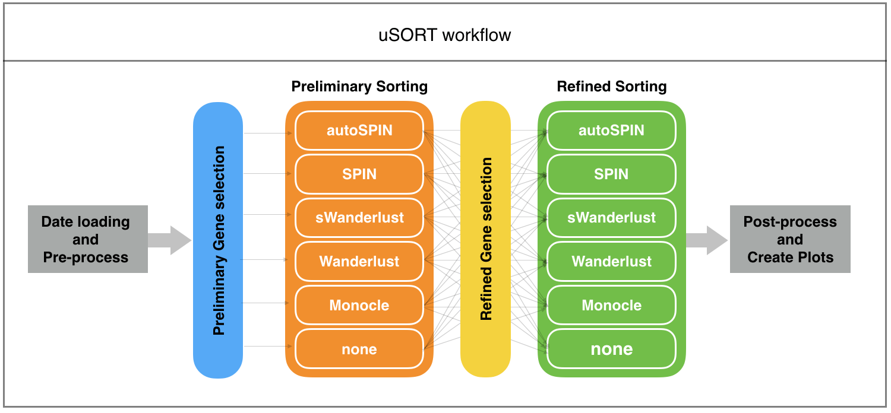

<!--
%% \VignetteEngine{knitr::rmarkdown}
%\VignetteIndexEntry{Quick Start}
-->


# uSORT workflow

**uSORT** package is designed to uncover the intrinsic cell progression path from single-cell RNA-seq data. It incorporates data pre-processing, preliminary PCA gene selection, preliminary cell ordering, refined gene selection, refined cell ordering, and post-analysis interpretation and visualization. The schematic overview of the uSORT workflow is shown in the figure below:



# Run uSORT 

The uSORT workflow can be applied through either the user-friendly GUI or calling the main function.

## uSORT GUI

After the installation of the uSORT pacakge, the GUI can be easily launched by a single command.

```{r}
require(uSORT)
# uSORT_GUI()  
```

On mac, the GUI will appear as shown below:


On the GUI, user can choose their input file (currently support TPM and CPM format in txt file), specify the priliminary sorting method and refined sorting method. By click the parameter button, user can further customize the parameters for each method. A parameter panel for `autoSPIN` method appears like below:


In the main GUI window, give a project name and choose the result path, then click submit. The program will run and details will be printed on the R console. Once the analysis is done, results will be saved under the selected result path.


## uSORT Main Function

User can also directly call the main function named `uSORT` of the pacakge. The documentation file can be extracted using command `?uSORT`. The usage and parameters of `uSORT` function is shown below:

```{r, eval=TRUE}
args(uSORT)
```


# uSORT Example

Runing the pacakge through the GUI is quite straightforward, so here we demo the usage of the main function with an example:

```{r, eval=TRUE}
dir <- system.file('extdata', package='uSORT')
file <- list.files(dir, pattern='.txt$', full=TRUE)
# uSORT_results <- uSORT(exprs_file = file, 
#                        log_transform = TRUE,
#                        remove_outliers = TRUE,
#                        project_name = "uSORT_example",
#                        preliminary_sorting_method = "autoSPIN", 
#                        refine_sorting_method = "sWanderlust",
#                        result_directory = getwd(),
#                        save_results = TRUE,
#                        reproduce_seed = 1234)
```

## Result Object and files

When the analysis is done, the results will be returned in a list:

```{r, eval=TRUE}
#str(uSORT_results)

# List of 7
#  $ exp_raw                        : num [1:251, 1:43280] 1.08 0 0 0.62 0 0 0 0.27 1.16 0 ...
#   ..- attr(*, "dimnames")=List of 2
#   .. ..$ : chr [1:251] "RMD119" "RMD087" "RMD078" "RMD225" ...
#   .. ..$ : chr [1:43280] "0610005C13Rik" "0610007P14Rik" "0610009B22Rik" "0610009E02Rik" ...
#  $ trimmed_log2exp                : num [1:241, 1:9918] 4.82 0 0 2.77 5.84 ...
#   ..- attr(*, "dimnames")=List of 2
#   .. ..$ : chr [1:241] "RMD119" "RMD087" "RMD078" "RMD225" ...
#   .. ..$ : chr [1:9918] "0610007P14Rik" "0610009B22Rik" "0610009E02Rik" "0610009O20Rik" ...
#  $ preliminary_sorting_genes      : chr [1:650] "1110038B12Rik" "1190002F15Rik" "2810417H13Rik" "5430435G22Rik" ...
#  $ preliminary_sorting_order      : chr [1:241] "RMD196" "RMD236" "RMD250" "RMD220" ...
#  $ refined_sorting_genes          : chr [1:320] "Mpo" "H2-Aa" "Cd74" "H2-Ab1" ...
#  $ refined_sorting_order          : chr [1:241] "RMD271" "RMD272" "RMD265" "RMD295" ...
#  $ driverGene_refinedOrder_log2exp: num [1:241, 1:320] 13.16 10.77 12.17 9.82 9.77 ...
#   ..- attr(*, "dimnames")=List of 2
#   .. ..$ : chr [1:241] "RMD271" "RMD272" "RMD265" "RMD295" ...
#   .. ..$ : chr [1:320] "Mpo" "H2-Aa" "Cd74" "H2-Ab1" ...
```

And if `save_results = TRUE`, several result files will be saved:

<u>uSORT\_example\_final\_driver\_genes\_profiles.pdf</u>:


<u>uSORT\_example\_distance\_heatmap\_preliminary.pdf</u>:


<u>uSORT\_example\_distance\_heatmap\_refined.pdf</u>:


If the cell type and signature genes are known, the reuslts can be validated with these information:

```{r, eval=TRUE}
# sig_genes <- read.table(file.path(system.file('extdata', package='uSORT'),  'signature_genes.txt'))
# sig_genes <- as.character(sig_genes[,1])
# spl_annotat <- read.table(file.path(system.file('extdata', package='uSORT'), 'celltype.txt'),header=T)
```

## Preliminary ordering heatmap with signature gene

```{r, eval=FALSE}
pre_log2ex <- uSORT_results$trimmed_log2exp[rev(uSORT_results$preliminary_sorting_order), ]
m <- spl_annotat[match(rownames(pre_log2ex), spl_annotat$SampleID), ]
celltype_color <- c('blue','red','black')
celltype <- c('MDP','CDP','PreDC')
cell_color <- celltype_color[match(m$GroupID, celltype)]
sigGenes_log2ex <- t(pre_log2ex[ ,colnames(pre_log2ex) %in% sig_genes])
fileNm <- paste0(project_name, '_signatureGenes_profiles_preliminary.pdf')
heatmap.2(as.matrix(sigGenes_log2ex), 
          dendrogram='row',
          trace='none',
          col = bluered,
          Rowv=T,Colv=F,
          scale = 'row',
          cexRow=1.8,
          ColSideColors=cell_color, 
          margins = c(8, 8))
    
legend("topright",
       legend=celltype,
       col=celltype_color,
       pch=20,
       horiz=T, 
       bty= "n", 
       inset=c(0,-0.01),
       pt.cex=1.5)
```


## Refine ordering heatmap with signature gene

```{r, eval=FALSE}
ref_log2ex <- uSORT_results$trimmed_log2exp[uSORT_results$refined_sorting_order, ]
m <- spl_annotat[match(rownames(ref_log2ex), spl_annotat$SampleID), ]
celltype_color <- c('blue','red','black')
celltype <- c('MDP','CDP','PreDC')
cell_color <- celltype_color[match(m$GroupID, celltype)]
sigGenes_log2ex <- t(ref_log2ex[ ,colnames(ref_log2ex) %in% sig_genes])
fileNm <- paste0(project_name, '_signatureGenes_profiles_refine.pdf')
heatmap.2(as.matrix(sigGenes_log2ex), 
          dendrogram='row',
          trace='none',
          col = bluered,
          Rowv=T,Colv=F,
          scale = 'row',
          cexRow=1.8,
          ColSideColors=cell_color, 
          margins = c(8, 8))
    
legend("topright",
       legend=celltype,
       col=celltype_color,
       pch=20,
       horiz=T, 
       bty= "n", 
       inset=c(0,-0.01),
       pt.cex=1.5)
```


 
 
# Session Information

```{r}
sessionInfo()
```

